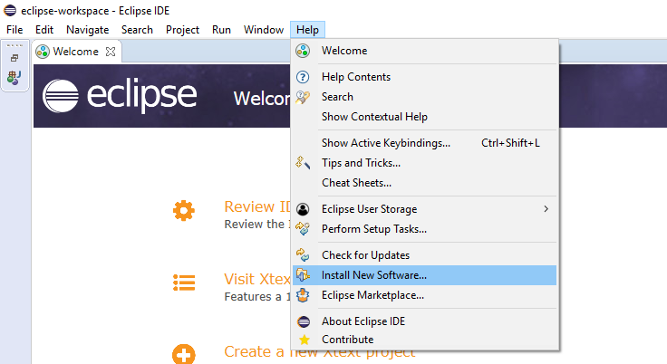
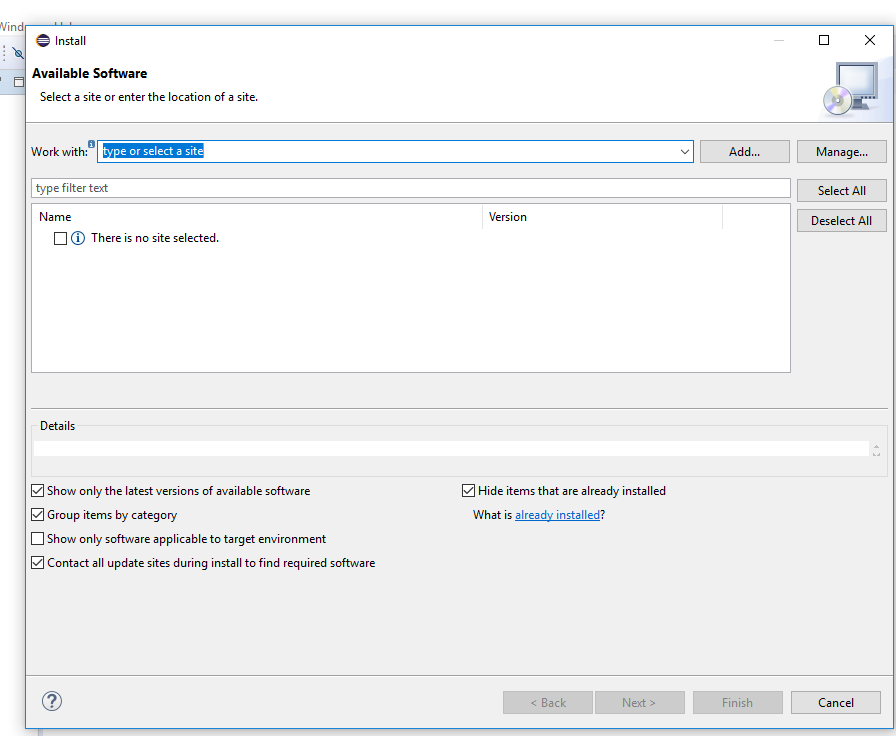
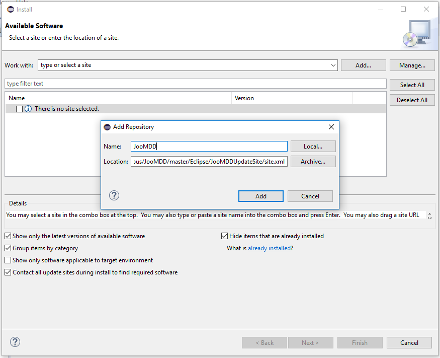
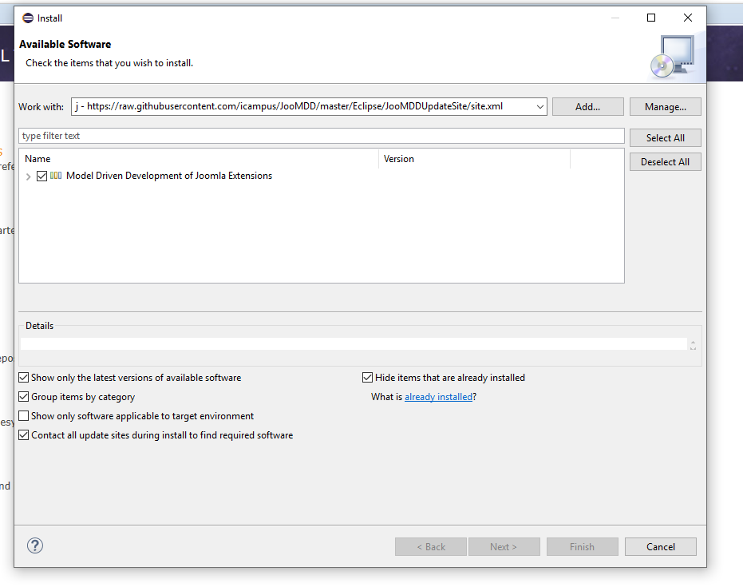
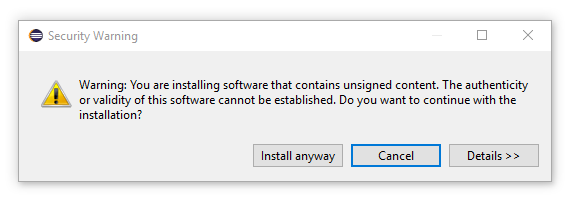
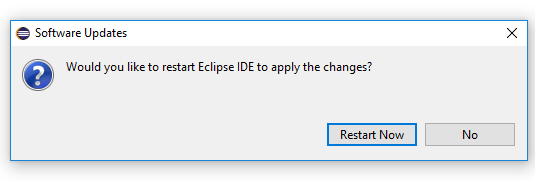

## Installation of JooMDD ##
Please follow this installation guide to use JooMDD within Eclipse, IntelliJ, and PhpStorm. 

### Eclipse ###
Install the JooMDD tools through the use of the following update site within the Eclipse update manager.

1. 

2. 

3. 

4. 

5. 

6. 

JooMDD update site (Eclipse): <https://raw.githubusercontent.com/icampus/JooMDD/master/Eclipse/JooMDDUpdateSite/site.xml>

### IntelliJ IDEA ###
Install the JooMDD tools through the use of the following update site within IntelliJ's plugin manager. As a precondition you have to install
the Xtext IDEA Core from the IntelliJ repositories.

#### Installation steps: ####
1. Install Xtext IDEA Core from the repositories of IntelliJ. (In IntelliJ go to: File/Settings/Plugins/Browse Repositories search: "Xtext 
Idea Core" and install the plugin).
2. Install the JooMDD plugin in the same way via the following JooMDD update site (alternatively you can download the plugins from this 
repository and install them manually into your IDE.):
JooMDD update site (IntelliJ IDEA): <https://raw.githubusercontent.com/icampus/JooMDD/master/IntelliJ/ideaRepository/updatePlugins.xml>.
3. Restart IntelliJ.
  

### PhpStorm ###
Install the JooMDD tools through the use of the following update site within PhpStorm's plugin manager. 

#### Installation steps: ####
1. Install the *Xtext IDEA Core* and JooMDD plugin from our repository using the following JooMDD update site (alternatively you can download the plugins from this repository and install them manually into your IDE):
JooMDD update site (PhpStorm): <https://raw.githubusercontent.com/icampus/JooMDD/master/PhpStorm/ideaRepository/updatePlugins.xml>.
2. Restart PhpStorm.